# Install OpenCV
OpenCV (Open Source Computer Vision Library) is a powerful library designed for computer vision. The library is cross-platform and free for use under the open-source Apache 2 License. OpenCV is written in C++ and its primary interface is in C++, but it also provides a Python interface. In this tutorial, we rely on it to detect keypoints, match them, and transform images.

## On Windows
Please open your anaconda propmt from Start menu.
<center>
    
</center>

Create a new python environment with `opencv-python 4.5`, `tqdm`, and `ipython` by following command.
```sh
(base) C:\Users\%USERNAME%> conda create --name opencv -c conda-forge opencv=4.5 tqdm ipython
```
Test your installation and you shall see the version of OpenCV is `4.5.x`.
```sh
(base) C:\Users\%USERNAME%> conda activate opencv
(opencv) C:\Users\%USERNAME%> python -c "import cv2; print(cv2.__version__)"
4.5.3
```
Every time you open anaconda propmt, you need to activate this environment before using OpenCV.
```sh
(base) C:\Users\%USERNAME%> conda activate opencv
(opencv) C:\Users\%USERNAME%> conda activate opencv
```

The newly created environment is located at `C:\Users\%USERNAME%\anaconda3\envs\opencv`. If you are using PyCharm, do not forget to set your project interpreter as `SetupPython.html` did in last tutorial.
```sh
# set project interpreter of PyCharm to
C:\Users\%USERNAME%\anaconda3\envs\opencv\python.exe
```

## On macOS
Open your Terminal app and create a new python environment with `opencv-python 4.5`, `tqdm`, and `ipython` by following command.
```sh
$ conda create --name opencv -c conda-forge opencv=4.5 tqdm ipython
```

Test your installation and you shall see the version of OpenCV is `4.5.x`.
```sh
$ conda activate opencv
$ python -c "import cv2; print(cv2.__version__)"
4.5.3
```

Every time you open anaconda propmt, you need to activate this environment before using OpenCV.
```sh
$ conda activate opencv
```

The newly created environment is located at `/Users/USERNAME/miniconda3/envs/opencv`. If you are using PyCharm, do not forget to set your project interpreter as `SetupPython.html` did in last tutorial.
```sh
# set project interpreter of PyCharm to
/Users/USERNAME/miniconda3/envs/opencv/bin/python
```

# Read/save/show images in OpenCV
OpenCV provides a set of APIs for us to easily read/write/show images.

## Read images
`cv2.imread` reads in an image as `np.ndarray` object with `dtype==np.uint8`, i.e., 8-bit unsigned integer.
```python
import cv2
import numpy as np

img = cv2.imread('image/md/left.jpg')
type(img)   # np.ndarray
img.shape   # (1512, 2016, 3), which indicates a color image.
img.dtype   # dtype('uint8')
```

You had better convert it to floating types before further processing to avoid any possible overflow.
```python
img = np.float32(img)
```

## Save images
`cv2.imwrite` takes an `np.ndarray` object as image and save it to file. If the `dtype` of the array is not `np.uint8`, the function will convert it to `np.uint8` before saving.
```python
cv2.imwrite('tmp.jpg',img) # return True, if write successfully.
```

## Show images
`cv2.imshow` shows an image, but the image won't be displayed util you call `cv2.waitKey`.
```python
cv2.imshow("window title", img)
cv2.waitKey(1)
# do not omit `1`, or else you have to hit a
# key in OpenCV window to return from waitKey.
```
`cv2.waitKey(delay)` will wait for `delay` milliseconds for user to hit a key and return the key user hit or `-1` if no key is hit. Its side-effect is to update OpenCV windows. If it is invoked without `delay` parameter or `deplay=0`, it will wait for infinite time. If you just want to update OpenCV window display and not really want user to hit a key, please use `cv2.waitKey(1)` like above.
```python
# wait for infinite time
cv2.waitKey()
cv2.waitKey(0)

# wait for just 1 ms, but can update window display
cv2.waitKey(1)
```

Use `cv2.destroyAllWindows` to close all windows. `cv2.waitKey` should also be called to let OpenCV update (close) windows.
```python
cv2.destroyAllWindows()
cv2.waitKey(1)
```

## Some utilities
Some utility function are provided in `utils.py` for you to easily read/write/show images.

```python
from utils import imread, imshow, write_and_show, destroyAllWindows

img = imread('image/md/left.jpg')

imshow('tmp.jpg', img)

write_and_show('tmp.jpg',img)

# give you some time to view all windows before close
destroyAllWindows()  

# close immediately
destroyAllWindows(wait_key=False)
```

# A brief history of keypoints detection

This brief history and review is summarised by OpenCV-Python tutorials^[[Feature Detection and Description -- OpenCV-Python Tutorials beta documentation](https://opencv24-python-tutorials.readthedocs.io/en/latest/py_tutorials/py_feature2d/py_table_of_contents_feature2d/py_table_of_contents_feature2d.html)].

1. Harris Corner Detection:^[Harris, C., & Stephens, M. (1988, August). A combined corner and edge detector. In Alvey vision conference (Vol. 15, No. 50, pp. 10-5244).]

    One early attempt to find these corners was done by Chris Harris & Mike Stephens in their paper A Combined Corner and Edge Detector in 1988, so now it is called Harris Corner Detector.

2. SIFT (Scale-Invariant Feature Transform):^[Lowe, D. G. (2004). Distinctive image features from scale-invariant keypoints. International journal of computer vision, 60(2), 91-110.]

    Harris corner detector is not good enough when scale of image changes. D.Lowe developed a breakthrough method to find scale-invariant features and it is called SIFT in 2004.

3. SURF (Speeded-Up Robust Features):^[Bay, H., Tuytelaars, T., & Van Gool, L. (2006, May). Surf: Speeded up robust features. In European conference on computer vision (pp. 404-417). Springer, Berlin, Heidelberg.]

    SIFT is really good, but not fast enough. In 2006, three people, Bay, H., Tuytelaars, T. and Van Gool, L, introduced a new algorithm called SURF. As name suggests, it is a speeded-up version of SIFT.

4. ORB (Oriented FAST and Rotated BRIEF):^[Rublee, E., Rabaud, V., Konolige, K., & Bradski, G. (2011, November). ORB: An efficient alternative to SIFT or SURF. In 2011 International conference on computer vision (pp. 2564-2571). IEEE.]

    This algorithm was brought up by Ethan Rublee, Vincent Rabaud, Kurt Konolige and Gary R. Bradski in their paper ORB: An efficient alternative to SIFT or SURF in 2011. As the title says, it is a good alternative to SIFT and SURF in computation cost, matching performance and mainly the patents. Yes, SIFT and SURF are patented and you are supposed to pay them for its use. But ORB is not !!! (correction: the patent of SIFT has already expired now).

In summary, Harris is the early one containing basic idea of corner detection. SIFT is the first mature one, but slow. SURF is a speeded-up version of SIFT. ORB is a free alternative for SIFT and SURF.

However, the patent of SIFT expired in March of 2020, so SIFT is free to use now ✌️! But patent of SURF is still valid now 🙁.

# Image alignment via SIFT
In this section, we are going to detect keypoints in two images via the classic SIFT detector then match these keypoints and align two images. Other keypoint detectors in OpenCV have similar API as SIFT, it is easy to use them once you know how to use SIFT. No matter which algorithm you use, the whole procedure always contains following steps.

1. Detect keypoints and generate keypoint descriptors.
3. Match detected keypoints between two images.
4. Align two images and stich them into one.

The two example images and final stitching result are shown here.

<center>
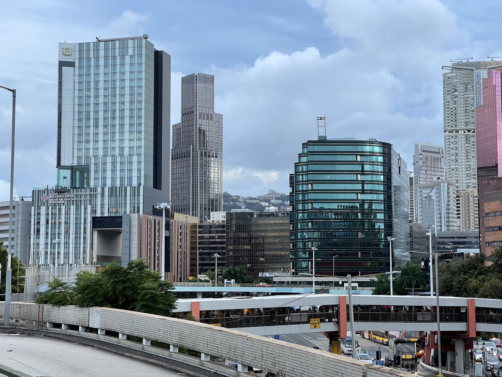
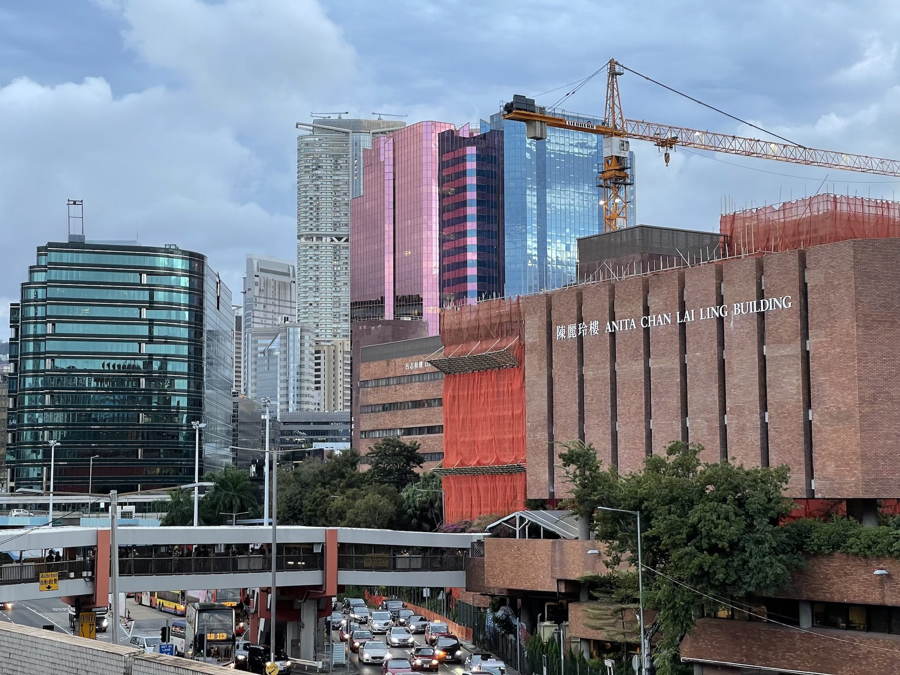

<p>Fig 1. (a) image 1. (b) image 2. (c) stitching result.</p>
</center>

## Detect keypoints and generate descriptors
First, we need to make sure our images are of type `np.uint8` and then convert it to grayscale. Because all keypoint detector in OpenCV can only deal with single-channel images. To process colourful image, we can either convert them to grayscale image before detection, or perform detection on three channels separately.

```python
img = imread('image/md/left.jpg')

img = np.uint8(img) # make sure it's np.uint8

img_gray = cv2.cvtColor(img, cv2.COLOR_BGR2GRAY) # to Gray Scale
```

Then we detect keypoints in two images and generate descriptors for them via SIFT.
```python
# SIFT
sift = cv2.SIFT_create()
keypoints, descriptors = sift.detectAndCompute(img_gray, mask=None)
```

Assume `N` keypoints are detected, then return values have following structure:

- `keypoints` is a list containing N `cv2.KeyPoint` objects. Every keypoint has following attributes:
    - `angle`: orientation of the descriptor.
    - `pt`: location of the keypoint in form of tuple `(x,y)`.
    - `response`: keypoint response. the higher, the more likely it is a keypoint. For SIFT, this is the DoG response.
    - `size`: scale of the keypoint.


```python
>>> from pprint import pprint
>>> type(keypoints)
list
>>> p = keypoints[0]
>>> pprint({name: p.__getattribute__(name) for name in dir(p) if not name.startswith('__')})
# You shall see something like this
{'angle': 83.27447509765625,
 ...,
 'pt': (2.505418539047241, 1013.8984375),
 'response': 0.01711214892566204,
 'size': 2.132431745529175}
```

- `descriptors` is an `np.array` of size `(N, 128)`. Each row stores an 128-dimensional descriptor for the corresponding keypoint.

```python
>>> descriptors
array([[  3.,   9.,  17., ...,   4.,   2.,   4.],
       [ 39.,   5.,   7., ...,   0.,   1.,   6.],
       [  0.,   0.,   0., ...,  15.,  12.,  11.],
       ...,
       [ 30.,  52.,   4., ...,   0.,   2.,  13.],
       [  0.,   0.,   0., ...,   4.,   2., 136.],
       [ 50., 131.,  30., ...,   0.,   0.,   0.]], dtype=float32)
```

We draw the detected keypoints on images by `cv2.drawKeypoints` function. Flag `cv2.DRAW_MATCHES_FLAGS_DRAW_RICH_KEYPOINTS` tells the function to show not only the location but also the size and orientation of keypoints.
```python
# draw keypoints
img_keypoints = cv2.drawKeypoints(
        image     = img,
        keypoints = keypoints,
        outImage  = None,
        flags     = cv2.DRAW_MATCHES_FLAGS_DRAW_RICH_KEYPOINTS)

write_and_show('img_keypoints.jpg', img_keypoints)
```
The detection results of two example images:
<center>
<a href="image/md/left_keypoints.jpg">
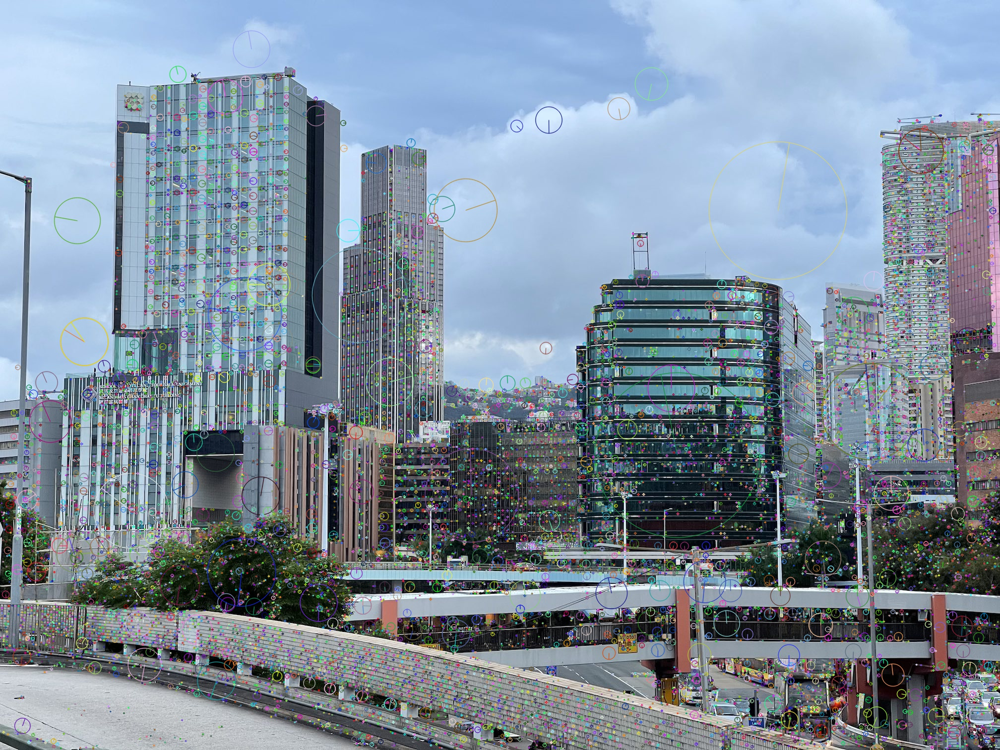
</a>
&nbsp;&nbsp;
<a href="image/md/right_keypoints.jpg">

</a>
<p>Fig 2. Keypoints detected.</p>
</center>

## Match
Assume we have detected keypoints in both image 1 and image 2 and generate their descriptors like this:
```python
sift = cv2.SIFT_create()
keypoints1, descriptors1 = sift.detectAndCompute(img1_gray, None)
keypoints2, descriptors2 = sift.detectAndCompute(img2_gray, None)
```
The next step is to match keypoints between two images. This is done by finding keypoint pairs from two images with similar descriptors. The descriptor describes what the area around a keypoint looks like. Similar descriptors indicate similar patterns. The similarity of descriptors is measured by their euclidean distance. Assume we have two 128-dimensional keypoint descriptors $u,v\in\mathbb{R}^{128}$, their distance is defined as
$$d(u,v) = \sqrt{\sum_{i=1}^{128}(u_i-v_i)^2}$$
Small $d(u,v)$ value indicates keypoint $u$ and $v$ looks similar. For each keypoint in image 1, we always match it with the most similar keypoint from image 2.

### Brute-force matcher
The matching could be done by `cv2.BFMatcher`:

```python
# create matcher
matcher = cv2.BFMatcher_create(crossCheck=True)

# get match
match = matcher.match(
            queryDescriptors = descriptors1,    # query
            trainDescriptors = descriptors2)    # train
# Docstring:
# match(queryDescriptors, trainDescriptors[, mask]) -> matches
# .   @brief Finds the best match for each descriptor from a query set.
```

The returned `match` is a list of `cv2.DMatch` object with following attributes:

- `distance`: euclidean distance between two matched keypoints as above formula.
- `queryIdx`: the index of matched keypoints in __image 1__.
- `trainIdx`: the index of matched keypoints in __image 2__.

```python
>>> type(match)
list
>>> m = match[0]
>>> pprint({name: m.__getattribute__(name) for name in dir(m) if not name.startswith('__')})
{'distance': 236.065673828125,
 ...,
 'queryIdx': 1,
 'trainIdx': 17140}
```

### FLANN based matcher
"BFMatcher" stands for "Brute-Forch Matcher". Brute-Force matcher is simple. It matches the descriptor in first set  with all other features in second set using some distance calculation. And the closest one is returned.

However, BFMatcher is super slow. FLANN is an fast alternative to BFMatcher. FLANN stands for "Fast Library for Approximate Nearest Neighbors". Its usage is similar to BFMatcher but works more faster for large datasets.

```python
# create macher
matcher = cv2.FlannBasedMatcher_create()

# get match
match = matcher.match(
            queryDescriptors = descriptors1,    # query
            trainDescriptors = descriptors2)    # train
```

### Lowe's ratio test
Sometimes the matching result contains lots of false matches. We could remove part of them by ratio test as Lowe's paper. The basic idea of Lowe's ratio test: each keypoint of the first image is matched with a number of keypoints from the second image. We keep the 2 best matches for each keypoint (best matches = the ones with the smallest distance measurement). Lowe's test checks that the two distances are sufficiently different. If they are not, then the keypoint is eliminated and will not be used for further calculations.

```python
matcher = cv2.FlannBasedMatcher_create()

# get best two matches
best_2 = matcher.knnMatch(
            queryDescriptors = descriptors1,
            trainDescriptors = descriptors2,
            k                = 2)

# Lowe's ratio test
ratio = 0.7
match = []
for m,n in best_2:
    if m.distance < ratio*n.distance:
        match.append(m)
```

### Select good matches

`distance` measures goodness of the match. We only select the match with small `distance`, and remove those with large distance.
```python
# sort by distance
match = sorted(match, key = lambda x:x.distance)

# take the best 100 matches
match = match[:100]
```

### Draw match
We can visualize all match keypoints by function `cv2.drawMatches`.
```python
match_draw = cv2.drawMatches(
        img1        = img1,
        keypoints1  = keypoints1,
        img2        = img2,
        keypoints2  = keypoints2,
        matches1to2 = match,
        outImg      = None,
        flags       = cv2.DrawMatchesFlags_NOT_DRAW_SINGLE_POINTS)

```
<center>
<a href="image/md/match.jpg">

</a>
<p>Fig 3. Matched keypoints.</p>
</center>

## Stich images
The final step is to stitch them into a single large image. First, we get coordinates of all matched keypoints:
```python
# get coordinates of matched pairs
keypoints1 = np.array([keypoints1[m.queryIdx].pt for m in match])
keypoints2 = np.array([keypoints2[m.trainIdx].pt for m in match])
```

### Perspective transform
Then we need to transform image 2 to align its keypoints with the matches ones in image 1. This is done by calculate a perspective transform from matched keypoints and then apply the transform to image 2.

Hereafter, we refer image 2 as __source image__ and image 1 as __destination image__. Calculate a perspective transform from source to destination image:
```python
src, dst = img2, img1
src_kps, dst_kps = (keypoints2, keypoints1)

T, status = cv2.findHomography(
                    srcPoints = src_kps,
                    dstPoints = dst_kps,
                    method    = cv2.USAC_ACCURATE,
                    ransacReprojThreshold = 3)
```
Not all matched keypoint pairs are correct. Incorrect matches lead to inaccurate transform. We can decide if a match is correct or not by checking whether the pairs are close enough after transformation. This is exactly what `cv2.USAC_ACCURATE` method does. The parameter `ransacReprojThreshold` is maximum allowed reprojection error to treat a point pair as correct. In above code, the maximum allowed reprojection error is 3 pixels.

The return value `status` indicates the correctness of keypoints. `status[i]==1` means `src_kps[i]` and `dst_kps[i]` are taken as a correct pair.

The return value `T` is a $3\times3$ transform matrix
$$\begin{equation}
T = \begin{bmatrix}
h_{11} & h_{12} & h_{13} \\
h_{21} & h_{22} & h_{23} \\
h_{31} & h_{32} & h_{33} \\
\end{bmatrix},
\end{equation}$$
which transforms a point at $(x,y)$ to location $(x', y')$:
$$\begin{equation}
\left\{
\begin{matrix}
x' =\dfrac{h_{11}x + h_{12}y + h_{13}}{h_{31}x + h_{32}y + h_{33}}\\
y' =\dfrac{h_{21}x + h_{22}y + h_{23}}{h_{31}x + h_{32}y + h_{33}}
\end{matrix} \right.
\end{equation}$$

We can apply the transformation `T` to image 2 by `cv2.warpPerspective`.
```python
H, W, _ = img2.shape
W = W*2

new_img2 = cv2.warpPerspective(
                    src   = img2,
                    M     = T,
                    dsize = (W, H),
                    dst   = np.zeros_like(img),
                    borderMode = cv2.BORDER_TRANSPARENT)
```
`dsize` specifies the size of transformed image.


<center>
<a href="image/md/new_img2.jpg">
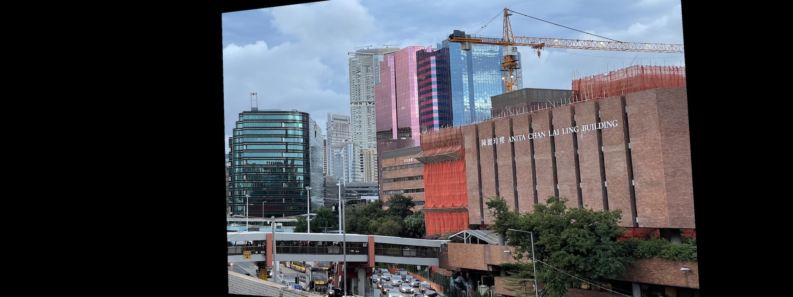
</a>
<p>Fig 3. transformed image 2.</p>
<a href="image/md/new_img1.jpg">

</a>
<p>Fig 4. resized image 1.</p>
</center>

We also need to pad image 1 with zeros to make have same size with transformed image 2.

```python
# resize img1
new_img1 = np.hstack([img1, np.zeros_like(img1)])
```

### Stack two image together

The last step is to stack them together. Direct average gives following result.
```python
direct_mean = new_img1/2 + new_img2/2
imshow('direct_mean.jpg', direct_mean)
```
<center>
<a href="image/md/direct_mean.jpg">

</a>
<p>Fig 5. Direct mean.</p>
</center>

Actually, we need to take average only for the overlapped part. For unoverlapped part, we should copy the pixel value from image 1 or image 2. This could be done by following code:
```python
# smart average
cnt = np.zeros([H,W,1]) + 1e-10     # add a tiny value to avoid ZeroDivisionError
cnt += (new_img2 != 0).any(2, keepdims=True)
cnt += (new_img1 != 0).any(2, keepdims=True)

# convert to floating number to avoid overflow
new_img1 = np.float32(new_img1)
new_img2 = np.float32(new_img2)

stack = (new_img2+new_img1)/cnt
imshow('stack.jpg', stack)
```
`cnt` counts how many images have a valid pixel at `(i,j)`:

- `cnt[i,j]` is 2, for overlapped part.
- `cnt[i,j]` is 1, if only one image have a valid pixel at `(i,j)`.
- `cnt[i,j]` is 0, if no image have a valid pixel at `(i,j)`.

<center>
<a href="image/md/stack.jpg">

</a>
<p>Fig 5. Smart average.</p>
</center>

# Panorama stitching
Last section introduced how to stitch two images into a large image. In this section, we learn how to stitch a video into a real panorama. First, we read in all frames of `image/Vcore.mov`. I provide a utility function `read_video_frames` in `utils.py` for you to load all frames from a video.

```python
from utils import read_video_frames

video_name = 'image/Vcore.mov'
images = read_video_frames(video_name)
```

The panorama is usually several times larger than video frames. For this video, we let `(H, W) = (h*4, w*3)`.
```python
h, w = images[0].shape[:2]
H, W = h*4, w*3
panorama = np.zeros([H,W,3]) # use a large canvas
```

Then we initialize our panorama with first frame. For this video, since V Core is scanned from its bottom right corner, so we place first frame at the bottom right corner of our panorama.
```python
# init panorama
h_start = H-h-h//2
w_start = W-w
panorama[h_start:h_start+h, w_start:w_start+w, :] = images[0]
```

Then we align all frames to this initial panorama one by one as last section did. Similarly, we need to maintain a `cnt` variable to record the count for each pixel and a `sum` variable to record the sum. To reduce computation, we may only stitch every forth or sixth frames.

```python
trans_sum = np.zeros([H,W,3])
cnt = np.ones([H,W,1])*1e-10
for img in tqdm(images[::4], 'processing'):
    # TODO: write your own code here as last section
    #       to align img with current panorama
    aligned_img = ...

    # combine
    trans_sum += aligned_img
    cnt += (trans != 0).any(2, keepdims=True)
    panorama = trans_sum/cnt

    # show
    imshow('panorama.jpg', panorama)
```

<center>
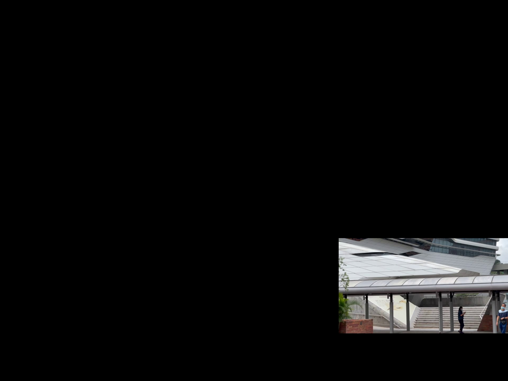
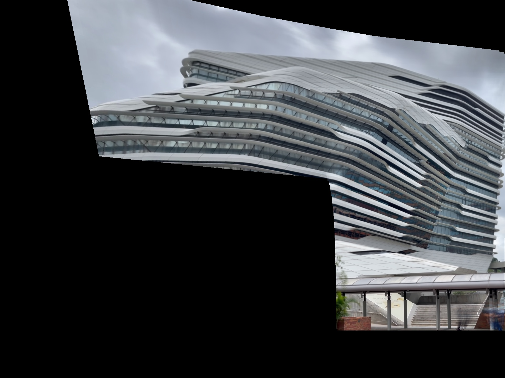

<p>Fig 6. From left to right: initial panorama; stitching half of frames; stitching all frames.</p>
</center>

# Video stabilization and stack denoising
Sometimes, the images we shoot contains lots of random noise, especially in dark environment. The most commonly seen noise is white noise as shown below.

<center>
<table>
  <tr>
    <td></td>
    <td style="vertical-align: middle;">=</td>
    <td></td>
    <td style="vertical-align: middle;">+</td>
    <td>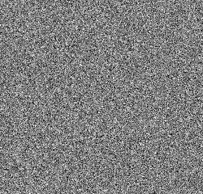</td>
  </tr>
</table>
<p>Fig 7. noisy image = scene + noise</p>
</center>

Noisy image can be considered as a combination of scene and noise. One way to reduce noise is to shoot multiple images or a video for the same scene, then 'stack' all images or frames together to get a clear image. Assume we have $n$ images/frames shot for the same scene:
$$
\begin{matrix}
\text{img}_1 = \text{scene} + \text{noise}_1 \\
\text{img}_2 = \text{scene} + \text{noise}_2 \\
\vdots\\
\text{img}_n = \text{scene} + \text{noise}_4 \\
\end{matrix}
$$

If we average all them together. The scene itself will be reserved and noises will cancel each other:
$$\begin{align*}
\frac{1}{N}\sum_i \text{img}_i
                    &= \text{scene} + \frac{1}{N}\sum_i \text{noise}_i \\
                    &\approx \text{scene}
\end{align*}$$

This is the basic idea of stack denoising. However, in reality, the multiple images are usually shot not from exactly same location or direction. The video we shot are also not stable enough. Directly stacking them leads to a blur image. So we need to align images or stabilise the video before stacking. The whole procedure contains two step:
1. align images (algorithm stabilization).
2. average them.

which is same as panorama stitching. Algorithm stabilization is an alternative to tripod. If you do not want to carry a heavy and big tripod with you everywhere, algorithm stabilization is a good alternative.

<center>

<p>Tripod</p>
</center>

## Long exposure
The first example is long exposure. Long exposure is good at capturing dark scene. Its mechanism is similar as stack denoising. However, sometimes long exposure is not enough either, especially in extreme dark environment. In this case, we could shot multiple images for the same scene and and stack them to get a clearer image.

The right most image below staks 10 images. Each of them is exposed for 3 seconds, so the stacked image is equivalent to 30 seconds exposure.

<center>
<a href="image/md/night.jpg">
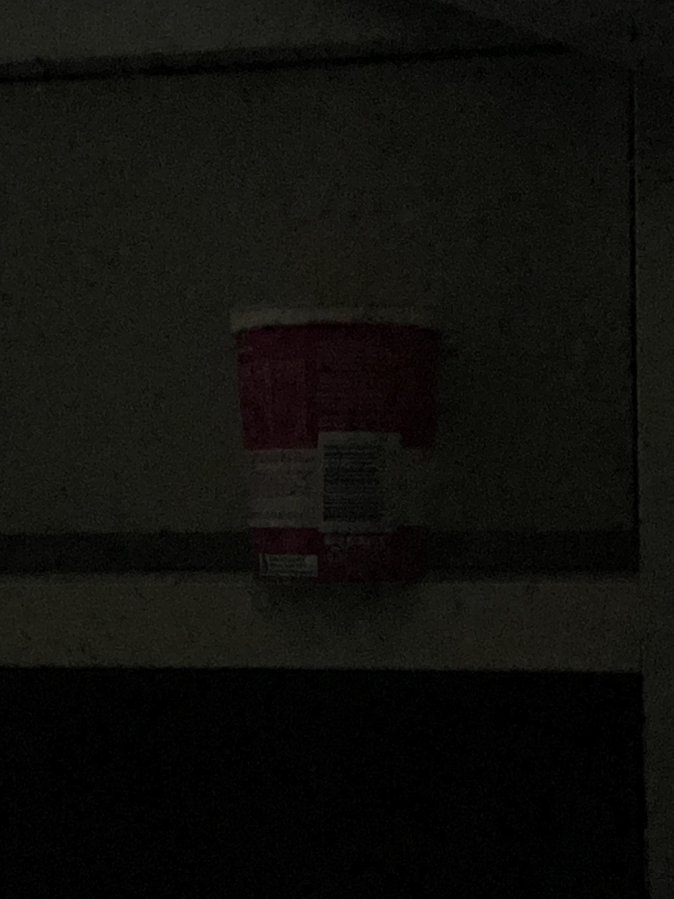</a>
<a href="image/night/0.jpg">
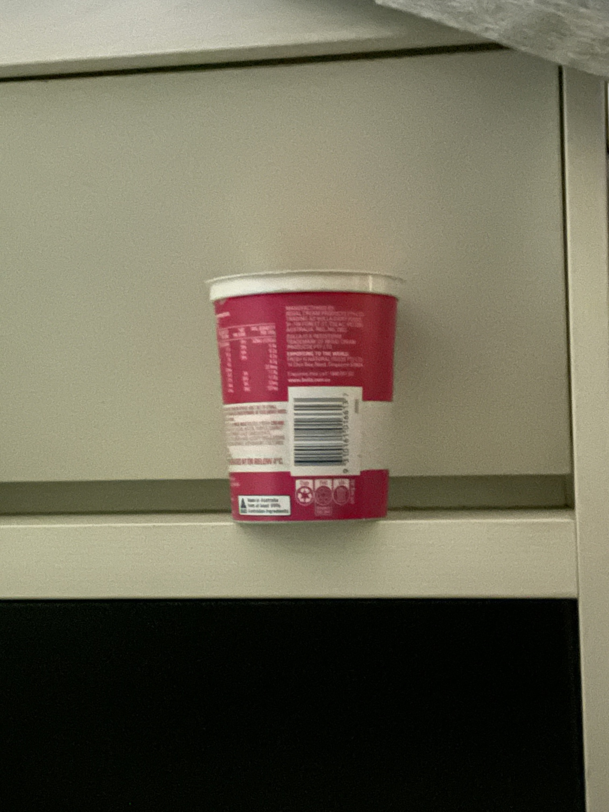</a>
<a href="image/md/night_mean.jpg">
</a>
<a href="image/md/night_stabilized_mean.jpg">
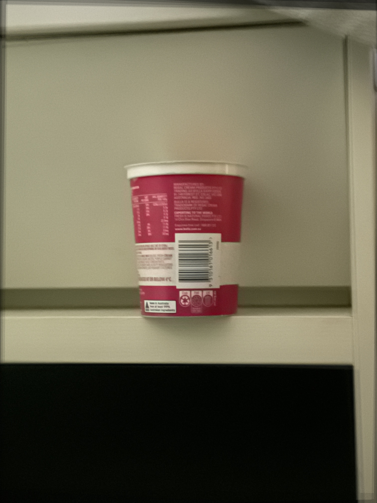</a>
<figcaption>Fig 6. From left to right: (a) no long exposure. (b) 3s long exposure. <br/> (c) stack 10 long-exposure images without stabilization. <br/> (d) stack 10 long-exposure images after stabilization.</figcaption>
</center>

## Deraining

Stack denoising can also be use to remove rain drops, if we consider rain drops as a kind of noise. It can produce a better result than the one produced by median filter. Median filter is a kind of single-image deraining technique. The main drawback of median filter is that it not only removes rain drops but also blur the image. Stack denoising overcomes this drawback, which can produce clear rain-free result, but require multiple images as input. Following figures compare results of median filter and stack denoising.

<center>
<a href="image/md/frame0.jpg">
</a>
<a href="image/md/mean.jpg">
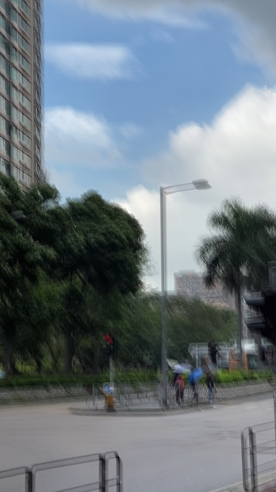</a>
<figcaption>Fig 7. (a) rainy image. (b) average without stabilization. </figcaption>

<a href="image/md/median.jpg">
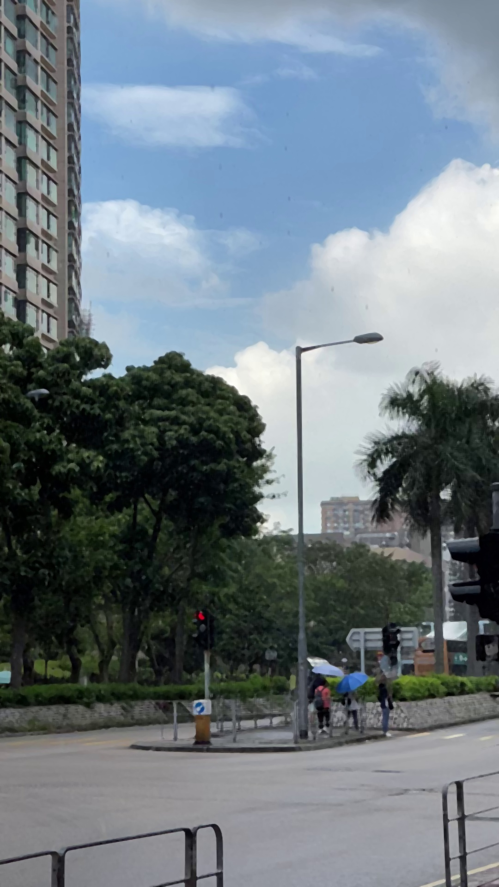</a>
<a href="image/md/stabilized_mean.jpg">
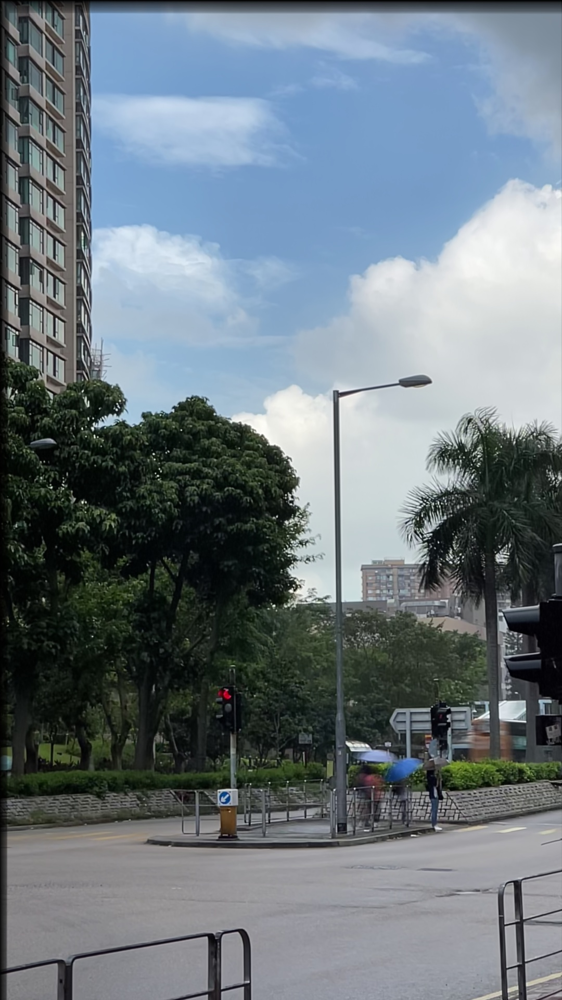</a>
<figcaption>Fig 7. (c) median filter. (d) average after stabilization (stack denoising). </figcaption>
</center>

# Assignment (12 points + 2 bonus points)

## Image alignment via SIFT (9 points)
First task is to perform keypoints detection and matching on `image/left2.mov` and `image/right2.jpg`. Please complete `sift.py` to finish this task.

Steps:

1. Read in first and last frame of video `image/rain2.mov`. Hereafter, we refer them as `img1` and `img2` respectively.

2. Convert them to grayscale image, and save the converted images as `img1_gray.jpg` and `img2_gray.jpg`. (1 point)

3. Detect keypoints of two images via SIFT, draw keypoints on them and save results as `img1_keypoints.jpg` and `img2_keypoints.jpg`. (2 points)

4. Match keypoints between two images, draw matched keypoints pairs, and save as `match.jpg`. (2 points: 1 for matching, 1 for Lowe's ratio test)

5. Obtain the transform matrix from `img2` to `img1` by `cv2.findHomography`. Print the transform matrix, and __include its value in your report__. (1 point)

6. Apply the transform matrix to `img2`, and save transformed result as `transformed.jpg`. (1 point)

7. Stack them into one image, and save as `stack.jpg`. (2 point)

## Panorama stitching (3 points)
Third task is to stitch all frames of video `image/wall_paint.mov` into a panorama. Please complete `utils.py` to finish this task.

Steps:

1. read in all frames of `image/wall_paint.mov`.
2. align all frames as above task.
3. average them into one panorama, and save as `panorama.jpg`. (3 points)

## Video stabilization and deraining (2 bonus points)
Second task is to stabilize video `image/rain2.MOV` such that we can stack all image together to get a rain-free image. Please complete `derain.py` to finish this task.

Steps:

1. read in all frames of `image/rain2.MOV`.
2. stabilize the video (align all frames with first one), and save stabilized video as `stabilized.mp4`. Tip: Function `write_frames_to_video` in `utils.py` can help you save a list of frames as a video. (1 point)
3. average stabilized frames into one image, and save as `stabilized_mean.jpg`. (1 point)


## Submission instruction

Your submission should include

1. A report contains all intermediate results (images you saved).
2. All source code that could reproduce your results. (`*.py`).
3. If your submission is too large to upload to BlackBoard, you may give an external link to your intermediate results instead of uploading them to BlackBoard.

Note: `cv2.createStitcher` and `cv2.Stitcher_create` are not allowed to use in this assignment.

Please submit before __23:59 on November 14 (Sunday)__. You may submit as many times as you want, but only your latest submission will be graded.

# References {-}
