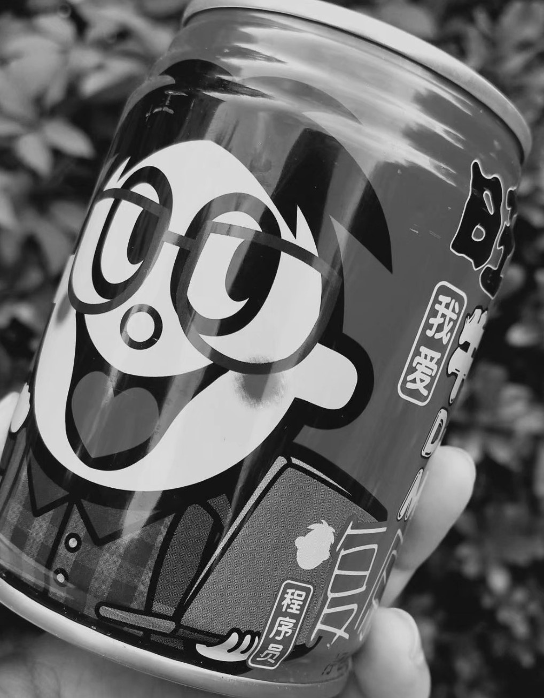
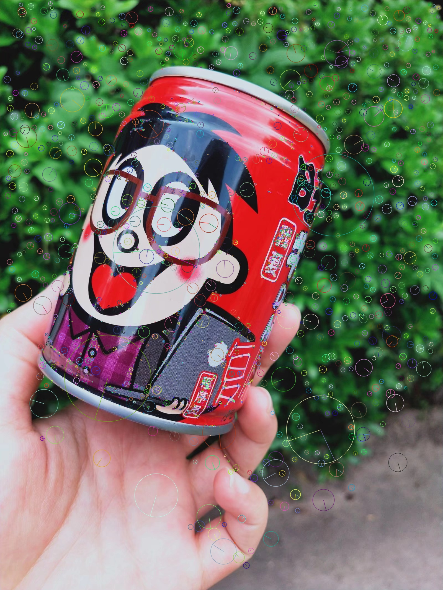
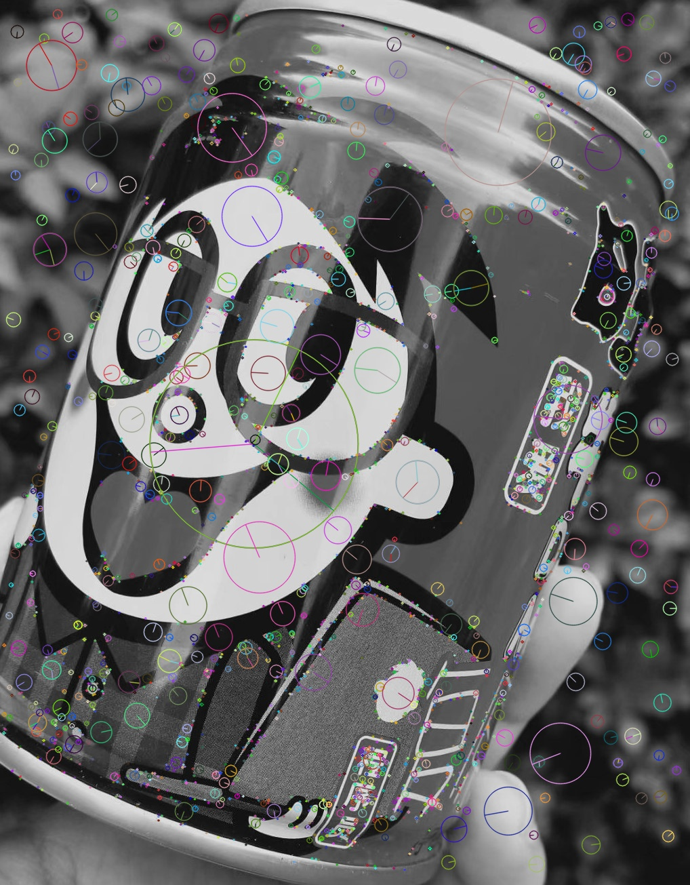
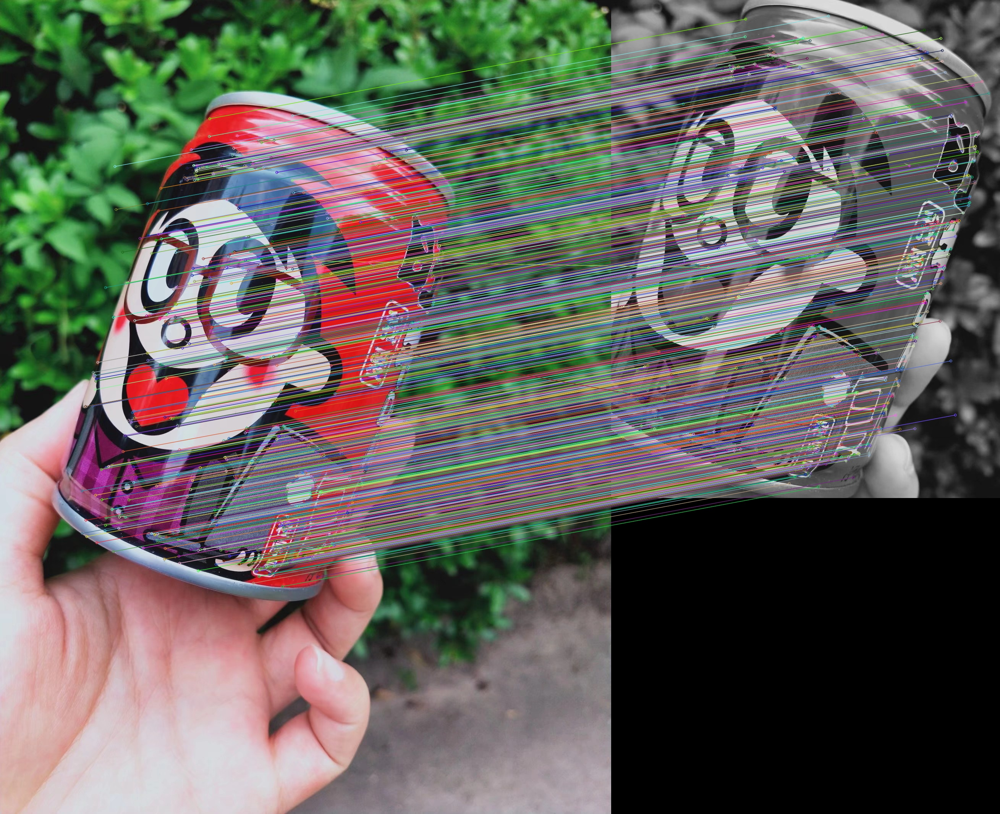
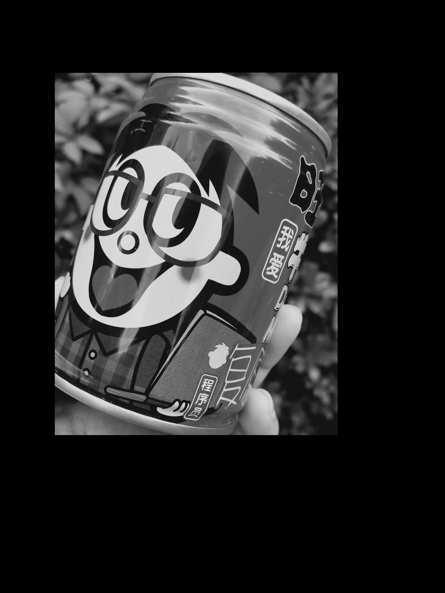
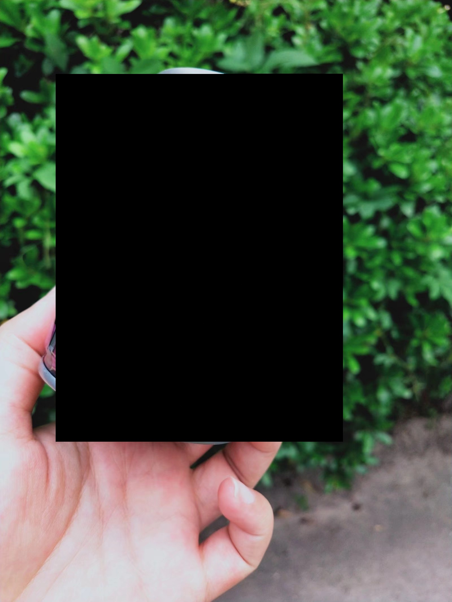
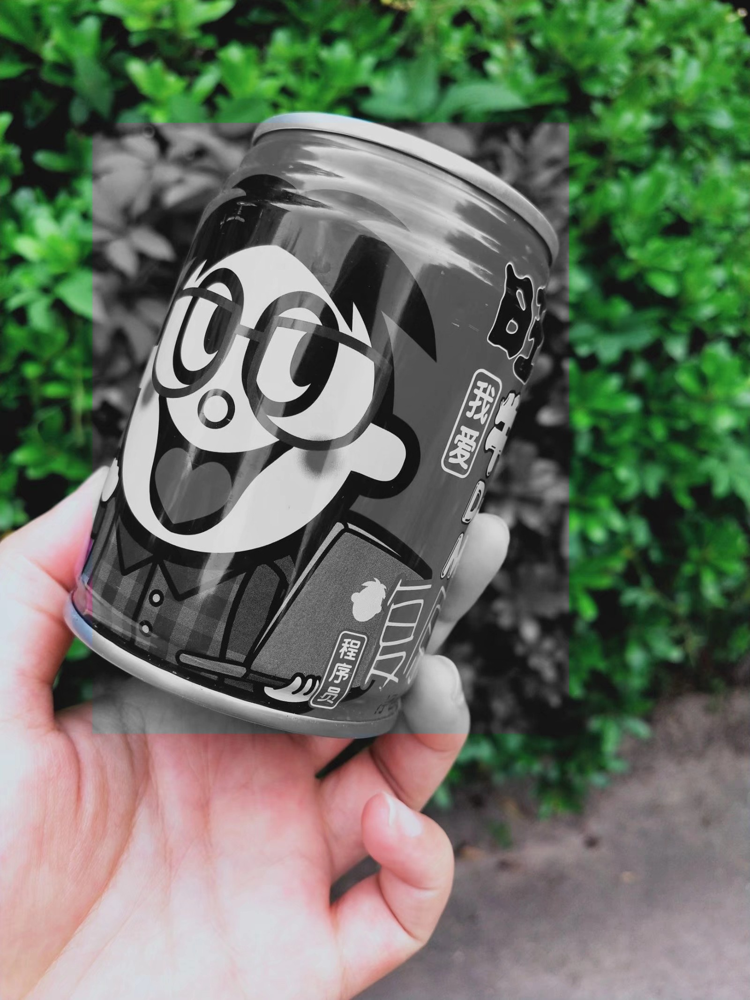

# 基于SIFT实现图像拼接（A look into the past）
核心技术要点：
1. 关键点检测（Keypoints Detection）
2. 匹配（Match）
3. 拼接（Image Stitich）

成员及分工：
1. 王志强 PB18051049
    - 算法设计
    - 代码实现
    - 文档撰写
2. 蒲明昱 PB18111733
    - 方案调研
    - 算法设计
    - 文档撰写

## 问题描述
1. 初衷和动机：[A look into the past](https://blog.flickr.net/en/2010/01/27/a-look-into-the-past)是一种图片艺术，让照片有了“昨日重现”的效果，很适合发朋友圈。所以，我们利用Computer Vision课堂上学到的知识，在一些我们感兴趣的照片上实现“A look into the past”。
2. 创意描述：打开手机相册，找一些有意思的照片，对某个部位进行截取。当然，如果会用PS的话，可以对该部分做更精细化的截取甚至做一些特效，可以得到更好的效果。因为懒，我们就直接截取了图片某个部分，将其转化为灰度图像，之后通过计算机视觉算法对两张图进行处理，最终得到“A look into the past”的效果。
3. 计算机视觉问题：上述创意的实现，可以转化为计算机视觉中的图像拼接问题，关键技术是关键点检测、匹配以及图像的缝合。

## 原理与实现

OpenCV(开源计算机视觉库)是一个功能强大的计算机视觉库。这个库是跨平台的，在开源的Apache 2许可下可以免费使用。OpenCV是用c++编写的，它的主要接口是用c++编写的，但它也提供了一个Python接口。我们依靠它来检测关键点、匹配关键点和转换图像。

### 关键点检测的简要历史
OpenCV-Python^[[Feature Detection and Description -- OpenCV-Python Tutorials beta documentation](https://opencv24-python-tutorials.readthedocs.io/en/latest/py_tutorials/py_feature2d/py_table_of_contents_feature2d/py_table_of_contents_feature2d.html)]教程对这段简短的历史和回顾进行了总结。

1. Harris Corner Detection:^[Harris, C., & Stephens, M. (1988, August). A combined corner and edge detector. In Alvey vision conference (Vol. 15, No. 50, pp. 10-5244).]

    One early attempt to find these corners was done by Chris Harris & Mike Stephens in their paper A Combined Corner and Edge Detector in 1988, so now it is called Harris Corner Detector.

2. SIFT (Scale-Invariant Feature Transform):^[Lowe, D. G. (2004). Distinctive image features from scale-invariant keypoints. International journal of computer vision, 60(2), 91-110.]

    Harris corner detector is not good enough when scale of image changes. D.Lowe developed a breakthrough method to find scale-invariant features and it is called SIFT in 2004.

3. SURF (Speeded-Up Robust Features):^[Bay, H., Tuytelaars, T., & Van Gool, L. (2006, May). Surf: Speeded up robust features. In European conference on computer vision (pp. 404-417). Springer, Berlin, Heidelberg.]

    SIFT is really good, but not fast enough. In 2006, three people, Bay, H., Tuytelaars, T. and Van Gool, L, introduced a new algorithm called SURF. As name suggests, it is a speeded-up version of SIFT.

4. ORB (Oriented FAST and Rotated BRIEF):^[Rublee, E., Rabaud, V., Konolige, K., & Bradski, G. (2011, November). ORB: An efficient alternative to SIFT or SURF. In 2011 International conference on computer vision (pp. 2564-2571). IEEE.]

    This algorithm was brought up by Ethan Rublee, Vincent Rabaud, Kurt Konolige and Gary R. Bradski in their paper ORB: An efficient alternative to SIFT or SURF in 2011. As the title says, it is a good alternative to SIFT and SURF in computation cost, matching performance and mainly the patents. Yes, SIFT and SURF are patented and you are supposed to pay them for its use. But ORB is not !!! (correction: the patent of SIFT has already expired now).

综上所述，Harris是最早包含角点检测基本思想的人。SIFT是第一个成熟的，但比较慢。SURF是SIFT的加速版。ORB是SIFT和SURF的免费选择

由于SIFT的专利已于2020年3月到期，所以SIFT现在可以免费使用 ✌️! 但是SURF的专利现在仍然有效 🙁.

### 基于SIFT的图像拼接
在本节中，我们将通过经典的SIFT检测器检测两幅图像中的关键点，然后匹配这些关键点并拼接两幅图像。OpenCV中的其他关键点检测器也有类似SIFT的API，一旦你知道如何使用SIFT，就很容易使用它们。无论使用哪种算法，整个过程都包含以下步骤。
1. 检测关键点并生成关键点描述符
2. 匹配两幅图像之间检测到的关键点
3. 对齐两个图像，并将它们拼接成一幅图

#### 检测关键点并生成描述符
首先，我们需要确保我们的图像是`np.uint8'类型，然后将它转换为灰度。因为OpenCV中所有的关键点检测器只能处理单通道图像。对于彩色图像，我们可以在检测前将其转换为灰度图像，或者分别在三个通道上进行检测。
```python
img = imread('image/md/left.jpg')

img = np.uint8(img) # make sure it's np.uint8

img_gray = cv2.cvtColor(img, cv2.COLOR_BGR2GRAY) # to Gray Scale
```

<table>
    <tr>
        <td ><center>Figure 1: now</center></td>
        <td ><center>Figure 2: past</center></td>
    </tr>
</table>

然后对两幅图像中的关键点进行检测，并通过SIFT生成关键点描述符。

```python
# SIFT
sift = cv2.SIFT_create()
keypoints, descriptors = sift.detectAndCompute(img_gray, mask=None)
```

假设检测到N个关键点，则返回值具有如下结构：

- `keypoints`是包含N个`cv2.KeyPoint`对象的列表。每个关键点有以下属性：
  - `angle`：描述符的方向
  - `pt`：以元组`(x,y)`形式表示的关键点的位置
  - `response`：关键点的响应值。越高，越有可能是一个关键点。对于SIFT，这是DoG响应
  - `size`：关键点的规模

```python
>>> from pprint import pprint
>>> type(keypoints)
list
>>> p = keypoints[0]
>>> pprint({name: p.__getattribute__(name) for name in dir(p) if not name.startswith('__')})
# You shall see something like this
{'angle': 83.27447509765625,
 ...,
 'pt': (2.505418539047241, 1013.8984375),
 'response': 0.01711214892566204,
 'size': 2.132431745529175}
```

`descriptors`是大小为`(N,128)`的`np.array`，每行存储对应关键点的128维描述符。

```python
>>> descriptors
array([[  3.,   9.,  17., ...,   4.,   2.,   4.],
       [ 39.,   5.,   7., ...,   0.,   1.,   6.],
       [  0.,   0.,   0., ...,  15.,  12.,  11.],
       ...,
       [ 30.,  52.,   4., ...,   0.,   2.,  13.],
       [  0.,   0.,   0., ...,   4.,   2., 136.],
       [ 50., 131.,  30., ...,   0.,   0.,   0.]], dtype=float32)
```

可以通过`cv2.drawKeypoints`函数在图上画出关键点。`cv2.DRAW_MATCHES_FLAGS_DRAW_RICH_KEYPOINTS`标志告诉函数不仅显示关键点的位置，而且还显示关键点的大小和方向。

```python
# draw keypoints
img_keypoints = cv2.drawKeypoints(
        image     = img,
        keypoints = keypoints,
        outImage  = None,
        flags     = cv2.DRAW_MATCHES_FLAGS_DRAW_RICH_KEYPOINTS)

write_and_show('img_keypoints.jpg', img_keypoints)
```

<table>
    <tr>
        <td ><center>Figure 3: now keypoints </center></td>
        <td ><center>Figure 4: past keypoints</center></td>
    </tr>
</table>

#### 关键点匹配

假设我们已经在图像1和图像2中检测到关键点，并像这样生成它们的描述符：

```python
sift = cv2.SIFT_create()
keypoints1, descriptors1 = sift.detectAndCompute(img1_gray, None)
keypoints2, descriptors2 = sift.detectAndCompute(img2_gray, None)
```

下一步是匹配两个图像之间的关键点。这是通过从两个具有相似描述符的图像中找到关键点对来完成的。描述符描述关键点周围的区域。相似的描述符表示相似的模式。描述符的相似性是由它们的欧几里得距离来度量的。

##### Brute-force matcher

匹配可以通过`cv2.NFMatcher`实现：

```python
# create matcher
matcher = cv2.BFMatcher_create(crossCheck=True)

# get match
match = matcher.match(
            queryDescriptors = descriptors1,    # query
            trainDescriptors = descriptors2)    # train
# Docstring:
# match(queryDescriptors, trainDescriptors[, mask]) -> matches
# .   @brief Finds the best match for each descriptor from a query set.
```

返回的`match`是一个`cv2.DMatch`对象的列表，有以下属性：

- `distance`：两个匹配关键点之间的欧几里德距离

- `queryIdx`：图像1中匹配关键点的索引

- `trainIdx`：图像2中匹配关键点的索引

```python
>>> type(match)
list
>>> m = match[0]
>>> pprint({name: m.__getattribute__(name) for name in dir(m) if not name.startswith('__')})
{'distance': 236.065673828125,
 ...,
 'queryIdx': 1,
 'trainIdx': 17140}
```

##### 基于FLANN的匹配器

“BFMatcher”代表“Brute-Forch Matcher”。蛮力匹配器很简单。它使用一些距离计算将第一个集合中的描述符与第二个集合中的所有其他特征匹配起来。离你最近的就会返回。

然而，BFMatcher超级慢。FLANN是BFMatcher的快速替代品。FLANN代表“近似近邻快速图书馆”。它的用法类似于BFMatcher，但对于大型数据集来说工作得更快。

```python
# create macher
matcher = cv2.FlannBasedMatcher_create()

# get match
match = matcher.match(
            queryDescriptors = descriptors1,    # query
            trainDescriptors = descriptors2)    # train
```

##### 劳氏比值判别法

有时匹配结果包含很多错误的匹配。我们可以像Lowe的论文那样通过比率检验去掉一部分。Lowe’s ratio test的基本思想是:第一幅图像中的每个关键点与第二幅图像中的多个关键点进行匹配。我们为每个关键点保留2个最佳匹配(最佳匹配=距离度量最小的匹配)。劳的试验检验了这两个距离是否足够不同。如果不是，则该关键点将被消除，不再用于进一步的计算。

```python
matcher = cv2.FlannBasedMatcher_create()

# get best two matches
best_2 = matcher.knnMatch(
            queryDescriptors = descriptors1,
            trainDescriptors = descriptors2,
            k                = 2)

# Lowe's ratio test
ratio = 0.7
match = []
for m,n in best_2:
    if m.distance < ratio*n.distance:
        match.append(m)
```

##### 选择良好的匹配

`distance`衡量匹配的好坏程度，我们只选择了具有最小`distance`的匹配，去除了那些更大距离的匹配。

```python
# sort by distance
match = sorted(match, key = lambda x:x.distance)

# take the best 100 matches
match = match[:100]
```

##### 匹配可视化

我们可以通过函数`cv2.drawMatches`可视化所有的匹配关键点。

```python
match_draw = cv2.drawMatches(
        img1        = img1,
        keypoints1  = keypoints1,
        img2        = img2,
        keypoints2  = keypoints2,
        matches1to2 = match,
        outImg      = None,
        flags       = cv2.DrawMatchesFlags_NOT_DRAW_SINGLE_POINTS)
```

<table>
    <tr>
        <td ><center>Figure 5: visualize match keypoints</center></td>
    </tr>
</table>

#### 图像拼接

最后一步是将它们拼接成一个大图像。首先，得到所有匹配关键点的坐标：

```python
# get coordinates of matched pairs
keypoints1 = np.array([keypoints1[m.queryIdx].pt for m in match])
keypoints2 = np.array([keypoints2[m.trainIdx].pt for m in match])
```

##### 透视变换

然后我们需要变换图像2，使其关键点与图像1中的关键点相匹配。这是通过从匹配的关键点计算一个透视变换，然后将变换应用到图像2来完成的。

此后，我们将图像2称为源图像，图像1称为目标图像。计算从源图像到目标图像的透视变换：

```python
src, dst = img2, img1
src_kps, dst_kps = (keypoints2, keypoints1)

T, status = cv2.findHomography(
                    srcPoints = src_kps,
                    dstPoints = dst_kps,
                    method    = cv2.USAC_ACCURATE,
                    ransacReprojThreshold = 3)
```

并非所有匹配的关键点对都是正确的。不正确的匹配会导致不准确的转换。我们可以通过检查变换后的对是否足够接近来判断匹配是否正确，这可以通过`cv2.USAC_ACCURATE`来执行。`ransacReprojThreshold`参数是将一个点对视为正确的最大允许重投影误差。在上面的代码中，允许的最大重投影误差是3像素。

返回值`status`表示关键点的正确性。`status[i]==1`表示`src_kps[i]`和`dst_kps[i]`是正确的对。

返回值`T`是一个$3\times3$的变换矩阵 $$\begin{equation} T = \begin{bmatrix} h_{11} & h_{12} & h_{13} \ h_{21} & h_{22} & h_{23} \ h_{31} & h_{32} & h_{33} \ \end{bmatrix}, \end{equation}$$_

将一个点从 $(x,y)$变换到位置$(x', y')$：

_$$\begin{equation} \left{ \begin{matrix} x' =\dfrac{h_{11}x + h_{12}y + h_{13}}{h_{31}x + h_{32}y + h_{33}}\ y' =\dfrac{h_{21}x + h_{22}y + h_{23}}{h_{31}x + h_{32}y + h_{33}} \end{matrix} \right. \end{equation}$$

我们可以通过`cv2.warpPerspective`对图像2应用变换`T`。

```python
H, W, _ = img2.shape

new_img2 = cv2.warpPerspective(
                    src   = img2,
                    M     = T,
                    dsize = (W, H),
                    dst   = np.zeros_like(img),
                    borderMode = cv2.BORDER_TRANSPARENT)
```

`dsize`指定转换后的图像的大小。

此外，为了更好的实现”past“效果，我们将图片1中图片2所占位置的像素全部置为0。

```python
index = (new_img2!=0)
img1[index] = 0
```

<table>
    <tr>
        <td ><center>Figure 6: perspective transformation to past</center></td>
        <td ><center>Figure 7: perspective transformation to now</center></td>
    </tr>
</table>

##### 图像叠加

最后一步是把它们堆在一起。直接平均给出以下结果。

```python
direct_mean = new_img1/2 + new_img2/2
imshow('direct_mean.jpg', direct_mean)
```

实际上，我们只需要取重叠部分的平均值。对于未重叠的部分，我们应该复制图像1或图像2的像素值。这可以通过以下代码来实现：

```python
# smart average
cnt = np.zeros([H,W,1]) + 1e-10     # add a tiny value to avoid ZeroDivisionError
cnt += (new_img2 != 0).any(2, keepdims=True)
cnt += (new_img1 != 0).any(2, keepdims=True)

# convert to floating number to avoid overflow
new_img1 = np.float32(new_img1)
new_img2 = np.float32(new_img2)

stack = (new_img2+new_img1)/cnt
imshow('stack.jpg', stack)
```

`cnt`统计在`(i,j)`处有多少个有效像素的图像：

- 对于重叠部分，`cnt[i,j]` 等于2
- 如果只有一幅图像在`(i,j)`处有有效像素，`cnt[i,j]`等于1
- 如果没有图像在`(i,j)`处有有效像素，则`cnt[i,j]`为0

## 效果展示

在图像拼接这块，我们的技术已经实现得非常好了。因为懒得抠图，我们只是随意的将图片中某部分截取下来进行简单的“past”处理，也就是转为黑白照片（灰度图像）。愿意花时间处理图片的话，可以将“A look into the past”渲染得很好看，这里简单展示上面的程序员版旺仔牛奶：

<table>
    <tr>
        <td ><center>Figure 8: stack image</center></td>
    </tr>
</table>


## 工程结构

```
.
├── image
├── README.md
├── requirements.txt
├── result
├── src
│   ├── main.py
│   ├── sift.py
│   └── utils.py
└── test.py
```

## 运行说明

本项目中，我们使用的python库以及版本如下：

```requirements.txt
numpy==1.21.5
opencv-python==4.5.4.60
tqdm==4.62.3
```

按照如下命令运行：

```shell
pip install -r requirements.txt
cd src/ && python main.py
```

