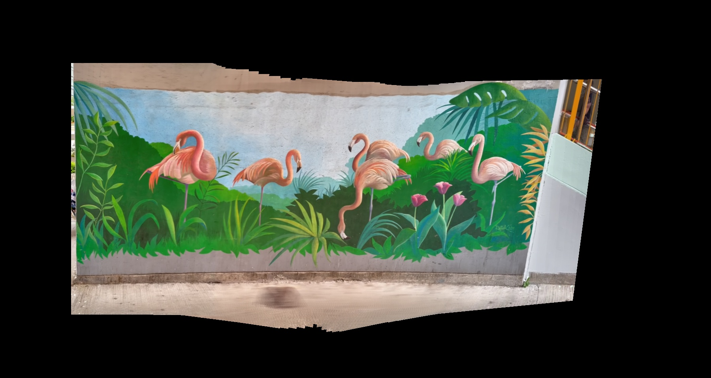

### Image alignment via SIFT

##### converted gray images

Gray image1


Gray image 2


##### detect keypoints

img1_keypoints


img2_keypoints


##### matched keypoints pairs


##### transform matrix

```
[[ 8.46609235e-01 -2.21802894e-02  9.18998890e+02]
 [-3.50460925e-02  9.55463912e-01  5.45922528e+01]
 [-7.61411535e-05 -1.01652866e-06  1.00000000e+00]]
```

#####  transformed result 


##### stack


### Panorama stitching

##### Result



